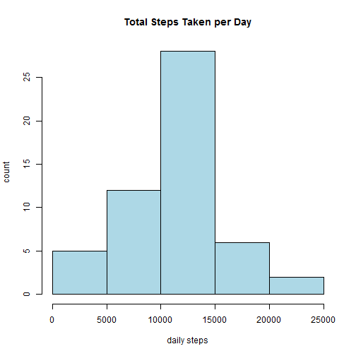
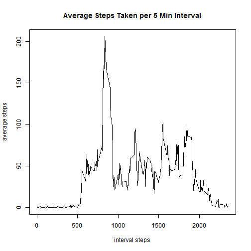
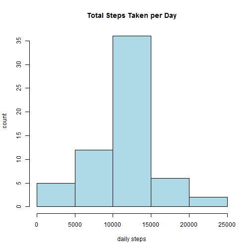
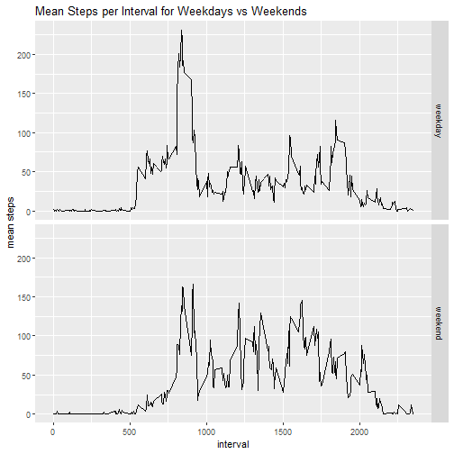

## Course Project 1: Using R Markdown and the Activity Dataset

This Course Project is focused on providing an opportunity to practice using R Markdown while processing an
Activity Dataset, which contains the number of steps recorded in 5 minute intervals over 61 days for one volunteer
subject. The dataset contains a number of NAs which will be processed and a variety of summary statistics and plots
will be calculated.

#### Some pre-processing steps
* Read the Data in
* Transform the date variable into class Date
* Remove observations with NAs


```r
activityData<-read.csv("activity.csv")
activityData$date<-as.Date(as.character(activityData$date))
activity<-na.omit(activityData)

suppressMessages(library(ggplot2))
suppressMessages(library(dplyr))
```
### I. What is the mean total number of steps taken per day?

#### Steps
* Group_by date
* Use summarize on the resulting dataset to get total steps per day  
* Plot histogram and calculate mean and median. 


```r
activity_bydate<-group_by(activity,date)
stepsDate<-summarize(activity_bydate,dailySteps=sum(steps,na.rm=TRUE))

hist(stepsDate$dailySteps,xlab="daily steps",ylab="count",main="Total Steps Taken per Day",col="light blue")
```



```r
dev.off()
```

```
## null device 
##           1
```

```r
meanSteps=mean(stepsDate$dailySteps)
medianSteps=median(stepsDate$dailySteps)
```

The mean number of steps is 1.0766189 &times; 10<sup>4</sup> steps while the median number of steps is 10765.

### II. What is the average daily activity pattern?

#### Steps
* Group_by date and then use summarize on resulting dataset to get mean steps per interval
* Plot scatterplot and calculate max and mean average interval steps. 
* Identify which interval has the max steps


```r
activity_byinterval <- group_by(activity,interval)
stepsInterval <- summarize(activity_byinterval,meanintervalSteps=mean(steps,na.rm=TRUE))

with(stepsInterval,plot(interval,meanintervalSteps,type="l",xlab="interval steps",ylab="average steps",main="Average Steps Taken per 5 Min Interval"))
```



```r
dev.off()
```

```
## null device 
##           1
```

```r
IntervalMax <- subset(stepsInterval,stepsInterval$meanintervalSteps==(max(stepsInterval$meanintervalSteps)))
IntervalMax$interval
```

```
## [1] 835
```
The interval with the max number of steps is 835.

### III. Imputing Missing Values

#### Preliminary processing steps
* Count the number of NAs in the dataset
* Impute missing steps by mean of that interval using the dataset, stepsInterval, created in the previous task.
* Add an NA indicator to stepsInterval to make a matching indicator for merging
* Add an NA indicator to rows of the original dataset with empty rows


```r
sum(is.na(activityData))
```

```
## [1] 2304
```

```r
stepsInterval$NAind<-"TRUE"
activityData$NAind<-is.na(activityData$steps)
```
#### Additional Steps 
* StepsMerge the stepsInterval dataset which contains the mean steps per interval with the dataset with missing rows. 
* Match based on the interval and NA ind to get a dataset, activitySubNew, that contains just the NA observations with the missing data imputed in. Drop extra columns to match the original dataset. 
* Reorder the columns of the resulting dataset, activitySubNew and merge it with the original dataset, activityData.


```r
activitySubNew<-merge(activityData,stepsInterval,by=c("interval","NAind"))
activitySubNew$steps<-activitySubNew$meanintervalSteps
activitySubNew$meanintervalSteps<-NULL
activitySubNew$NAind<-NULL
activitySubNew<-activitySubNew[c(2,3,1)]
activityNew<-rbind(activitySubNew, activity)
```
#### Last Steps
* Group_by date and then use summarize on resulting dataset to get total steps per day.
* Plot histogram and calculate mean and median average steps per day. 
* Compare mean and median with those previous calculated with the cleaned up dataset removing NAs.


```r
activity_bydate<-group_by(activityNew,date)
stepsDate<-summarize(activity_bydate,dailySteps=sum(steps,na.rm=TRUE))

hist(stepsDate$dailySteps,xlab="daily steps",ylab="count",main="Total Steps Taken per Day",col="light blue")
```



```r
dev.off()
```

```
## null device 
##           1
```

```r
meanSteps=mean(stepsDate$dailySteps)
medianSteps=median(stepsDate$dailySteps)
```
The mean number of steps is 1.0766189 &times; 10<sup>4</sup> while the median number of steps is 1.0766189 &times; 10<sup>4</sup>. The median and mean are now the same whereas before the median was slightly less. Imputing the mean per interval value for missing steps caused the median and mean values to align.

### IV. Are There Differences in Activty Patterns Between Weekdays and Weekends?
* Create a factor variable to indicate weekday vs weekend
* Group by the interval and new factor variable
* Plot a panel plot breaking down mean steps by interval separately for weekend vs weekday days.


```r
activityNew$dayType<-ifelse(weekdays(activityNew$date) %in% c("Saturday","Sunday"),"weekend","weekday")
activityNew$dayType<-as.factor(activityNew$dayType)

activity_byinterval<-group_by(activityNew,interval,dayType)
stepsInterval<-summarize(activity_byinterval,meanintervalSteps=mean(steps,na.rm=TRUE))

p <- ggplot(stepsInterval,aes(interval,meanintervalSteps))+geom_line()
p+facet_grid(dayType~.)+labs(x="interval",y="mean steps",title="Mean Steps per Interval for Weekdays vs Weekends")+theme(legend.position = c(0.16, 0.85))
```



```r
dev.off()
```

```
## null device 
##           1
```
Weekends seem to have lower average steps towards the beginning of the day. The maximum number of steps per interval is higher on the weekday, but weekend days seem to have more regular steps throughout the day. All these observations coincides with weekdays where people get up earlier, but then are relatively sedentary during the day. Weekends start later and perhaps the maximum number of steps in any interval period is smaller, but there is more consistent activity throughout the day. 
